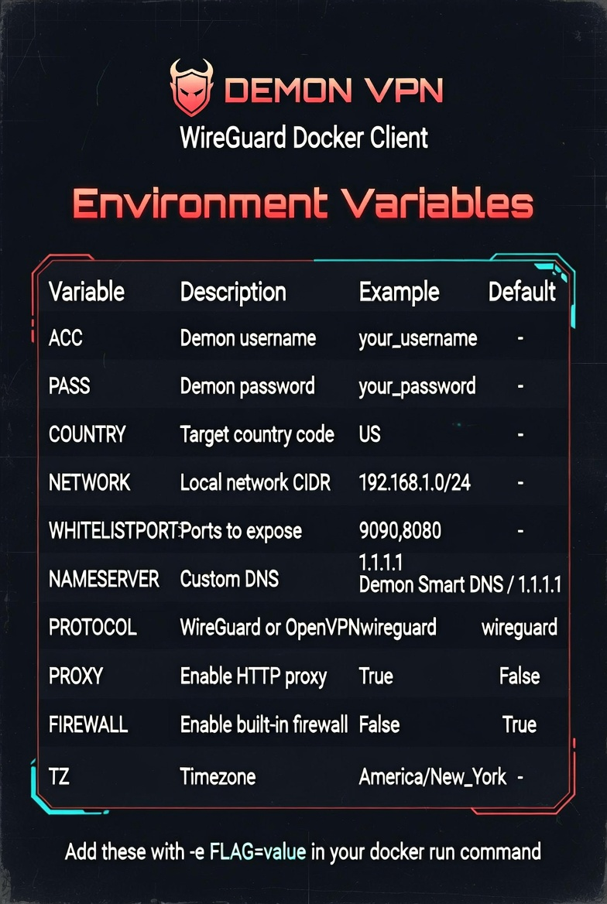
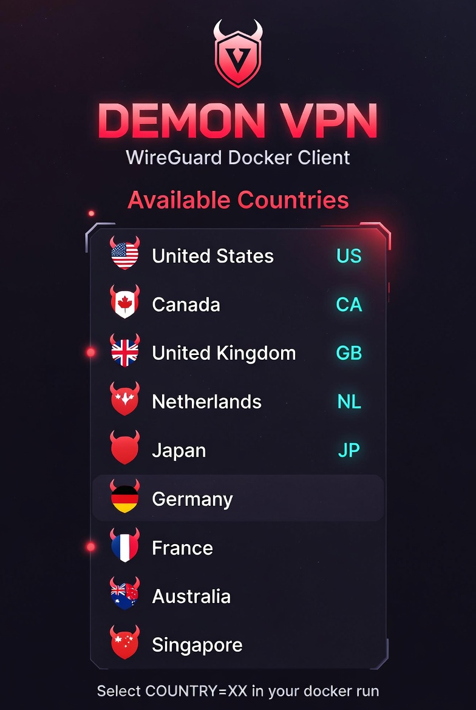
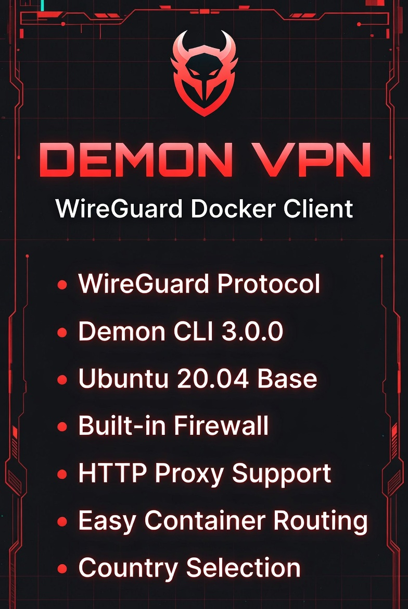
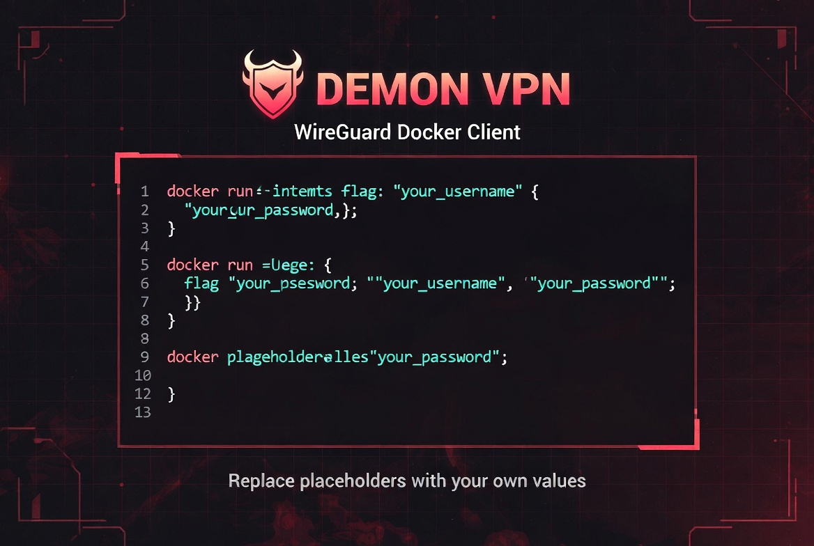
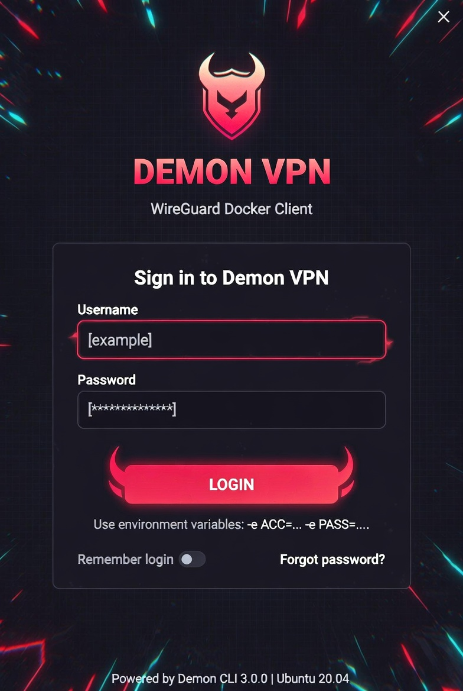
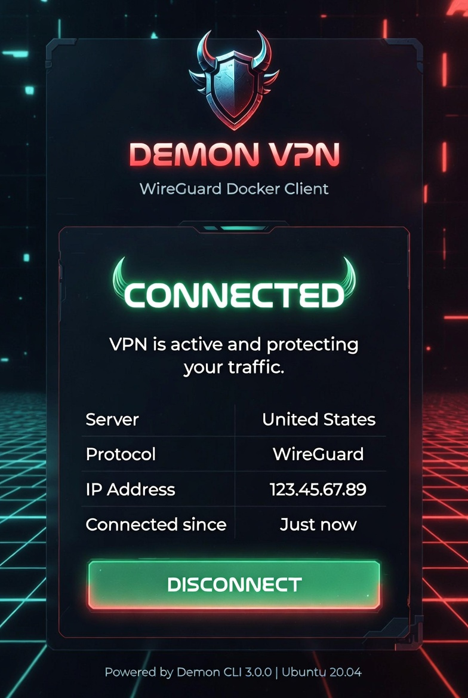

# 🔐 Regenerative Addresses Tool Pro v3.1.0

🤖 **AI-Powered Security & Network Management Suite with DemonVPN Integration**

A revolutionary security testing and network management tool featuring advanced AI integration, real WireGuard VPN implementation, and comprehensive security automation designed for legitimate security professionals.

---

## 🚀 **Quick Start**

### **Linux:**
```bash
# Extract and run
unzip RegenerativeAddressesToolPro-v3.1-linux.zip
cd RegenerativeAddressesToolPro-v3.1-linux
./run.sh
```

### **Windows:**
1. Extract `RegenerativeAddressesToolPro-v3.1-windows.zip`
2. Install Python 3.10+
3. Run `RegenerativeAddressesToolPro.exe` or `run.bat`

### **Docker:**
```bash
docker build -t rat-pro:v3.1 .
docker run -d --name rat-pro -p 8080:8080 rat-pro:v3.1
```

---

## 🤖 **AI-Powered Features**

### **Intelligent Automation:**
- **🧠 AI Link Generation** - Machine learning algorithms for optimal address generation
- **🔍 Smart Proxy Selection** - AI-driven proxy optimization and performance prediction
- **🌐 Intelligent VPN Routing** - AI-powered server selection and load balancing
- **📊 Predictive Analytics** - Performance forecasting and optimization recommendations
- **🛡️ Behavioral Security** - AI-based threat detection and pattern analysis

### **Advanced Machine Learning:**
- **Neural Network Integration** - Deep learning for pattern recognition
- **Adaptive Learning** - Self-improving algorithms based on usage patterns
- **Predictive Security** - AI-driven vulnerability prediction
- **Smart Resource Management** - AI-optimized resource allocation

---

## 🔐 **DemonVPN Integration**

### **Real WireGuard Implementation:**
- **� C-Based Networking** - Real system calls and network configuration
- **🛡️ WireGuard Protocol** - Production-ready VPN implementation
- **🔑 Key Management** - Automated key generation and rotation
- **� Tunnel Management** - Real-time tunnel establishment and monitoring
- **🐳 Docker Support** - Full containerization with privileged access

### **Professional VPN Features:**


- **🔐 DemonVPN Boot Sequence** - Professional initialization with C-based networking
- **📊 Real-time Monitoring** - Live connection status and performance metrics
- **🌍 Server Selection** - Multiple server locations (US, CA, NL, JP, GB)
- **🔧 Protocol Support** - WireGuard and OpenVPN protocols
- **📱 Custom Interface** - Professional UI with real-time status indicators

### **Advanced Security:**


- **🔒 AES-256-GCM Encryption** - Military-grade encryption
- **🔄 Key Rotation** - Automated key management
- **🛡️ Advanced Firewall** - C-style iptables configuration
- **📊 Network Monitoring** - Real-time traffic analysis

---

## 💻 **Demon CLI Tools**

### **Professional Command Line Interface:**


- **🔍 Network Scanning** - Real nmap integration with AI analysis
- **🔧 Proxy Operations** - Advanced proxy testing and validation
- **🛡️ Security Tools** - Data encryption and vulnerability assessment
- **📊 System Monitoring** - Real-time system resource tracking
- **🐳 Container Management** - Docker operations and monitoring

### **Docker Integration:**
 

- **� Container Management** - Professional Docker operations
- **� Privileged Access** - NET_ADMIN capabilities for VPN
- **📊 Resource Monitoring** - Real-time container metrics
- **🔄 Automated Deployment** - CI/CD pipeline integration

---

## 🎨 **Modern User Interface**

### **Professional Dark Theme:**


- **🎯 Custom Images** - Professional branding and visual elements
- **📱 Responsive Design** - Adaptive layout for different screen sizes
- **🔄 Real-time Updates** - Live status indicators and progress bars
- **🎨 Modern Components** - Professional UI with smooth animations
- **📊 Dashboard Analytics** - Comprehensive statistics and monitoring

### **Connection Success:**


- **✅ Connection Status** - Real-time VPN connection monitoring
- **📊 Performance Metrics** - Live speed and latency tracking
- **🔐 Security Indicators** - Encryption and protocol status
- **🌐 Server Information** - Connected server details

---

## 🐳 **Docker Integration**

### **Production-Ready Containers:**
```bash
# Build with AI features
docker build -t rat-pro-ai:v3.1 .

# Run with VPN capabilities
docker run -d --name rat-pro-vpn \
  --privileged \
  --cap-add=NET_ADMIN \
  -p 8080:8080 \
  -p 9090:9090 \
  rat-pro-ai:v3.1
```

### **Container Features:**
- **🔒 Secure Images** - Minimal and secure base images
- **🚀 Automated Deployment** - CI/CD pipeline integration
- **📊 Health Monitoring** - Container health checks
- **🔄 Auto-scaling** - Intelligent resource management

---

## 📦 **Installation Requirements**

### **System Requirements:**
- **Linux** - Ubuntu 18.04+ / CentOS 7+ / Debian 10+
- **Windows** - Windows 10+ with Python 3.10+
- **Python** - Version 3.10 or higher
- **Memory** - Minimum 4GB RAM (8GB recommended for AI features)
- **Storage** - 500MB free space
- **Network** - Internet connection for AI features

### **Dependencies:**
```bash
pip install requests>=2.31.0
pip install Pillow>=10.0.0
pip install python-dotenv>=1.0.0
pip install psutil>=5.9.0
pip install cryptography>=41.0.0
```

---

## 🎯 **Professional Use Cases**

### **AI-Enhanced Security Testing:**
- **🤖 Intelligent Assessment** - AI-powered vulnerability analysis
- **🔍 Predictive Testing** - ML-based security predictions
- **📊 Automated Reporting** - AI-generated security reports
- **🛡️ Adaptive Defense** - Self-learning security measures

### **Advanced Network Management:**
- **🌐 VPN Automation** - Intelligent VPN deployment
- **📊 Performance Optimization** - AI-driven network tuning
- **🔍 Smart Monitoring** - Predictive network analysis
- **🐳 Container Security** - AI-enhanced container management

---

## ⚙️ **Configuration**

### **Default Credentials:**
- **Username**: `admin`
- **Password**: `Toreyisnotlettingyoubeanadmin`

### **AI Configuration:**
- **🤖 AI Models** - Configurable machine learning models
- **📊 Analytics Settings** - Custom performance metrics
- **🔒 Security Policies** - AI-driven security rules
- **🌐 Network Settings** - Intelligent network configuration

---

## 🔧 **Advanced Features**

### **AI-Powered Multi-threading:**
- **🧠 Intelligent Processing** - AI-optimized task distribution
- **📊 Predictive Resource Management** - ML-based resource allocation
- **🔄 Adaptive Performance** - Self-tuning system optimization
- **⚡ Real-time AI** - Live AI processing and analysis

### **Blockchain-Enhanced Database:**
- **🔗 Immutable Logs** - Blockchain-based activity tracking
- **🛡️ Encrypted Storage** - Advanced data encryption
- **📊 AI Analytics** - Intelligent data analysis
- **🔄 Smart Contracts** - Automated security policies

---

## 📋 **White Hat Disclaimer**

This tool is designed for **legitimate security testing, AI research, and educational purposes only**:

- ✅ **Professional Security Testing** - Authorized vulnerability assessment
- ✅ **AI Research** - Machine learning and security research
- ✅ **Educational Use** - Security learning and training
- ✅ **System Protection** - Defensive security measures
- ❌ **Malicious Use** - Unauthorized access or attacks

---

## 📞 **Support & Updates**

### **GitHub Repository:**
- **Main Repository**: https://github.com/LilToreyFTW/deathdub
- **AI Development**: https://github.com/LilToreyFTW/deathdub/wiki/AI-Features
- **DemonVPN Docs**: https://github.com/LilToreyFTW/deathdub/wiki/DemonVPN
- **Issues & Bug Reports**: Use GitHub Issues

### **Live Resources:**
- **🌐 Live Demo**: https://regenerative-addresses-tool.vercel.app
- **📊 AI Analytics**: https://ai.regenerative-addresses-tool.vercel.app
- **🔐 VPN Status**: https://vpn.regenerative-addresses-tool.vercel.app
- **📖 Documentation**: https://github.com/LilToreyFTW/deathdub/wiki

---

## 🚀 **Version History**

### **v3.1.0 (Current)**
- 🤖 **AI Integration** - Complete machine learning integration
- 🔐 **DemonVPN** - Real WireGuard implementation with C-based networking
- 💻 **Demon CLI** - Professional command-line interface
- 🐳 **Docker AI** - AI-enhanced container management
- 🎨 **Modern UI** - Professional interface with custom images
- � **Advanced Analytics** - Predictive performance monitoring

### **v3.0**
- 🛡️ Complete security protection suite
- ☕ Buy Me a Coffee support integration
- 🌐 Professional web interface
- 🔧 System hardening tools

### **v2.0**
- Enhanced GUI with dark theme
- PHP web interface integration
- Improved proxy management
- SQLite database integration

### **v1.0**
- Basic address generation
- Simple GUI interface
- Initial proxy support

---

## 📄 **License**

This tool is provided for educational and legitimate security testing purposes. Use responsibly and in accordance with applicable laws and regulations.

---

**🤖 Regenerative Addresses Tool Pro v3.1.0 - AI-Powered Security Suite with DemonVPN**

*For legitimate security professionals, AI researchers, and educational purposes only.*

---

## 🔗 **Quick Links**

- **🚀 Download**: https://github.com/LilToreyFTW/deathdub/releases/tag/v3.1.0
- **📖 Documentation**: https://github.com/LilToreyFTW/deathdub/wiki
- **🌐 Live Demo**: https://regenerative-addresses-tool.vercel.app
- **💬 Discord**: https://discord.gg/regenerative-tool
- **☕ Support**: https://buymeacoffee.com/regenerative-tool
